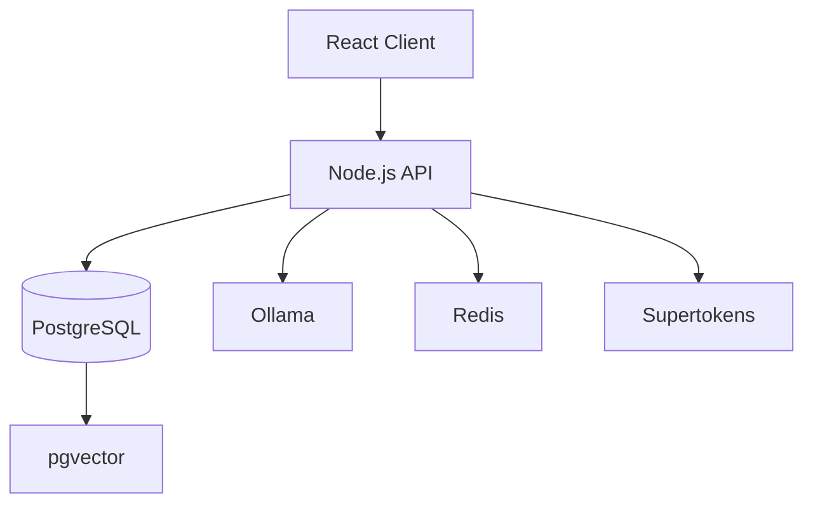
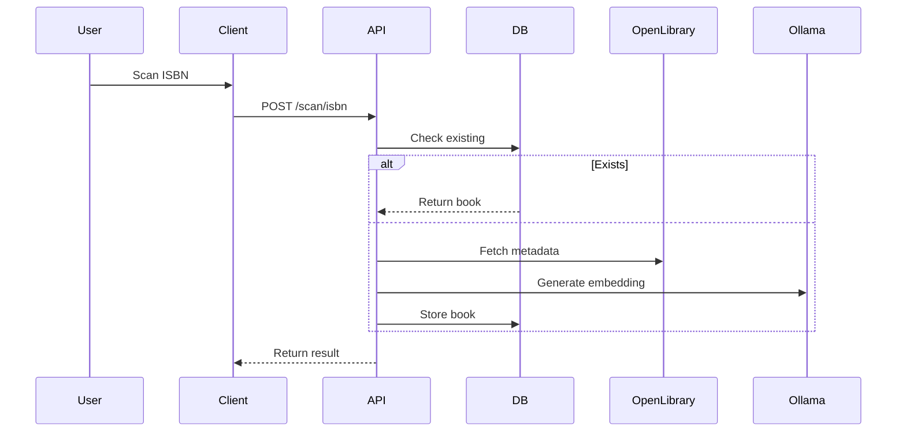
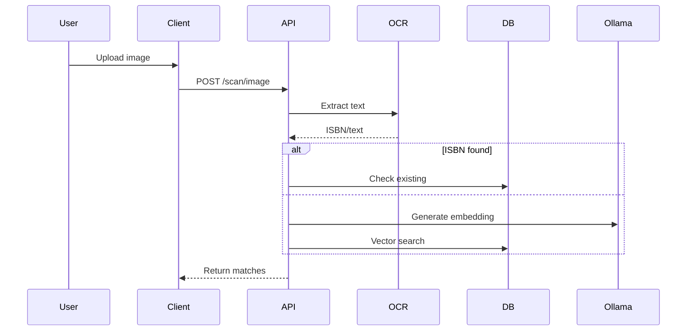

```markdown
# BookScan - Personal Library Management System

[](https://www.docker.com/)
[](https://www.postgresql.org/)
[](https://supertokens.com/)

A containerized solution for managing personal book collections with OCR and semantic search capabilities.

## Table of Contents
- [Features](#features)
- [Architecture](#architecture)
- [Prerequisites](#prerequisites)
- [Installation](#installation)
- [Configuration](#configuration)
- [Database Setup](#database-setup)
- [API Endpoints](#api-endpoints)
- [Workflows](#workflows)
- [Security](#security)
- [Deployment](#deployment)
- [Troubleshooting](#troubleshooting)
- [Contributing](#contributing)
- [License](#license)

## Features
- 📚 ISBN barcode scanning with OpenLibrary fallback
- 📷 Cover image OCR processing
- 🔍 Semantic search using vector embeddings
- 🔐 User-specific collections with shared book data
- 🐳 Full Docker containerization
- ⚡ Redis caching layer
- 🔄 Automatic metadata reuse

## Architecture



**Components**:
- **Frontend**: React with camera/image upload capabilities
- **Backend**: Express.js API gateway
- **Database**: PostgreSQL 15 with pgvector extension
- **Auth**: Supertokens with session management
- **ML**: Ollama for text embeddings
- **Cache**: Redis for frequent queries

## Prerequisites
- Docker 20.10+
- Docker Compose 2.20+
- Node.js 18+
- Ollama model (run `ollama pull llama2`)

## Installation

1. Clone repository:
```bash
git clone https://github.com/elabz/bookscan.git
cd bookscan
```

2. Create environment file:
```bash
cp .env.example .env
```

3. Start services:
```bash
docker-compose up --build
```

## Configuration
`.env` file structure:
```ini
# PostgreSQL
POSTGRES_USER=bookuser
POSTGRES_PASSWORD=securepass
POSTGRES_DB=bookscan

# Redis
REDIS_URL=redis://redis:6379

# Ollama
OLLAMA_ENDPOINT=http://ollama:11434

# Supertokens
SUPERTOKENS_CONNECTION_URI=http://supertokens:3567
```

## Database Setup
1. Connect to PostgreSQL:
```bash
docker exec -it booksan-postgres-1 psql -U bookuser -d booksan
```

2. Create tables:
```sql
CREATE TABLE books (
    id SERIAL PRIMARY KEY,
    isbn VARCHAR(13) UNIQUE,
    title TEXT NOT NULL,
    authors TEXT[],
    description TEXT,
    cover_url TEXT,
    embedding VECTOR(768),
    source VARCHAR(20) DEFAULT 'user'
);

CREATE TABLE user_books (
    user_id UUID REFERENCES users(id),
    book_id INT REFERENCES books(id),
    scanned_at TIMESTAMPTZ DEFAULT NOW(),
    PRIMARY KEY (user_id, book_id)
);

CREATE INDEX book_embedding_idx ON books USING ivfflat (embedding vector_cosine_ops);
```

## API Endpoints

| Endpoint | Method | Description |
|----------|--------|-------------|
| `/auth/*` | POST | Authentication routes |
| `/books/scan/isbn` | POST | Process ISBN barcode |
| `/books/scan/image` | POST | Process cover image |
| `/books/search` | GET | Public book search |
| `/me/books` | GET | User's personal collection |

## Workflows

**ISBN Scanning**:


**Image Processing**:


## Security
- 🔒 Row-Level Security (RLS) on user_books
- 🔄 JWT token rotation
- 🛑 Rate limiting on scan endpoints
- 🔍 Input validation for all user-provided data
- 🛡️ Isolated OCR processing in worker threads

## Deployment
1. Production considerations:
```yaml
# docker-compose.prod.yml
services:
  backend:
    deploy:
      replicas: 3
    environment:
      - NODE_ENV=production
      
  redis:
    config:
      - maxmemory 1gb
      - maxmemory-policy allkeys-lru
```

2. Monitoring:
- PGAdmin for PostgreSQL
- RedisInsight for Redis
- Prometheus for metrics

## Troubleshooting
**Common Issues**:
- OCR failures: Check Tesseract language packs
- Vector search errors: Verify pgvector extension
- Auth problems: Validate Supertokens network connections

**Logs**:
```bash
docker-compose logs -f backend
```

## Contributing
1. Fork the repository
2. Create feature branch (`git checkout -b feature`)
3. Commit changes (`git commit -am 'Add feature'`)
4. Push branch (`git push origin feature`)
5. Open Pull Request

## License
MIT License - see [LICENSE](LICENSE) for details